# CaptureITProject
CaptureIt Project

This application is buid to enhance the communication between Photographers and customers.CaptureIT mobile application will make a virtual platform where customers can book
photographers easily and quickly, on the other hand photographers/studios can improve their
business and skills in a convenient way. In addition, the two parties can communicate through
messages and photographers/studios can upload photos. Furthermore, by the map (GPS
system) customers can book the nearest best photographer to have their photoshoots done.

# Downloads
https://github.com/Pasan99/CaptureITProject/raw/master/app-debug.apk

# Screenshots
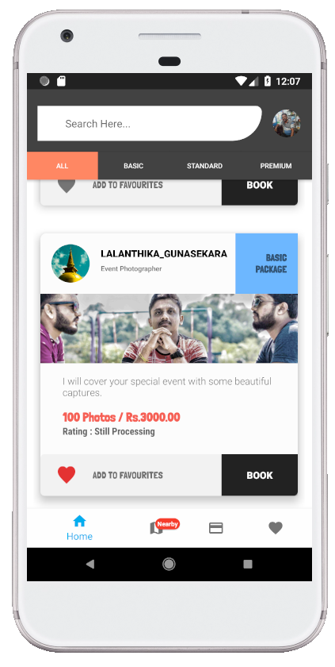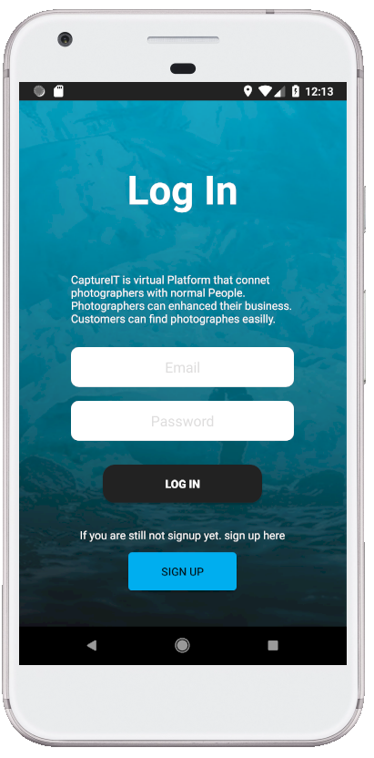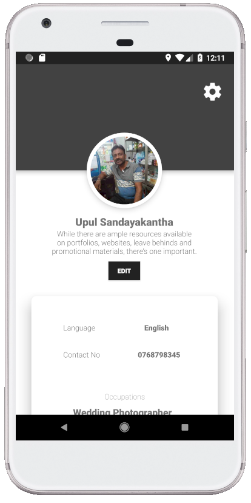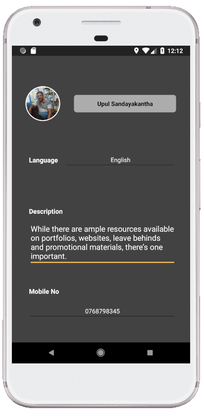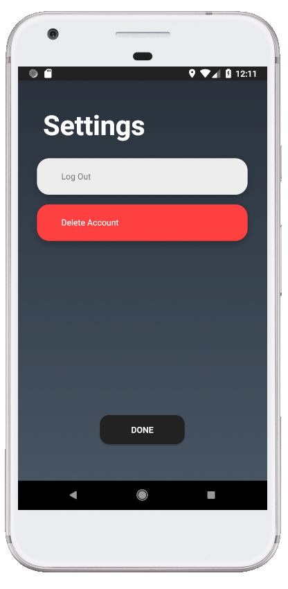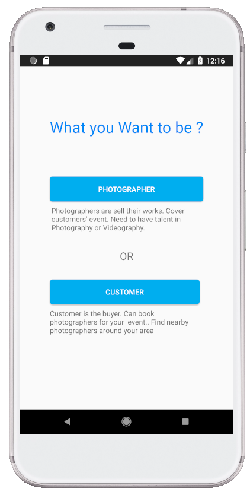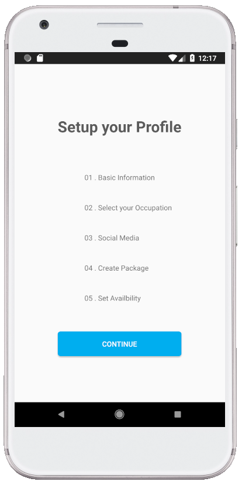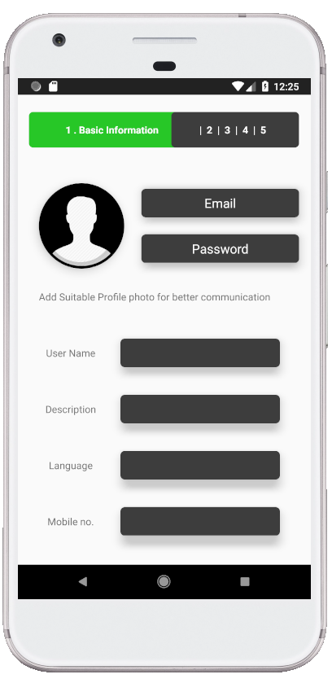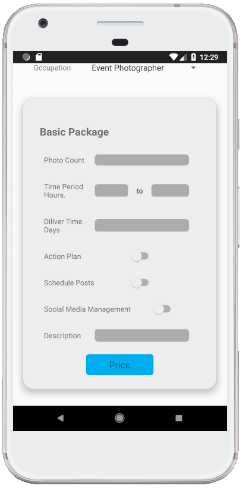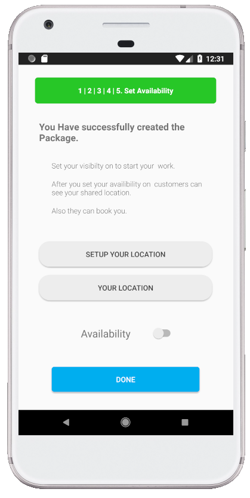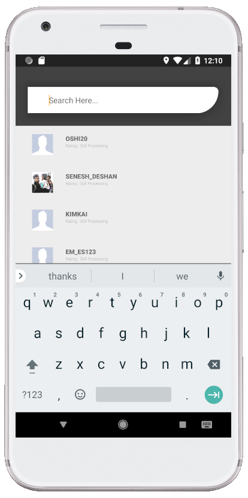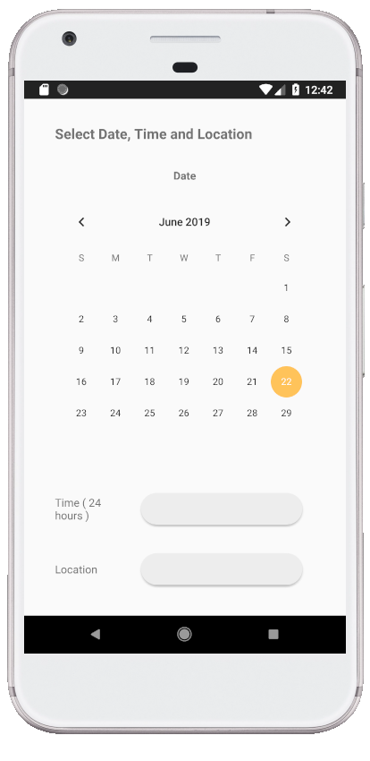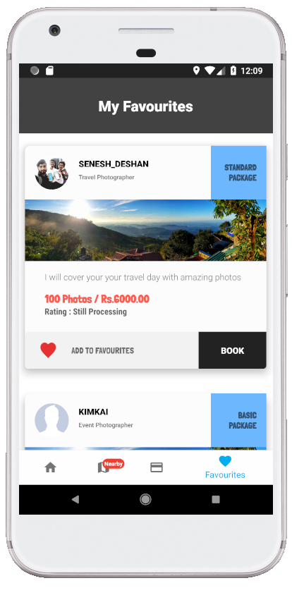

# Services Used
Database - Firebase (by GOOGLE) 
Android Studio 
Language - Java 

# Reffered Websites
Google material Design - https://material.io/ 
Android Developers Website - https://developer.android.com/ 
Firebase - https://firebase.google.com/ 
Design - https://dribbble.com/
Icons - https://www.flaticon.com/

# Reffered Youtube channels
Android Developer - https://www.youtube.com/user/androiddevelopers 
Firebase - https://www.youtube.com/user/Firebase 
Google Design - https://www.youtube.com/channel/UClKO7be7O9cUGL94PHnAeOA 
Google Developer - https://www.youtube.com/channel/UC_x5XG1OV2P6uZZ5FSM9Ttw 
