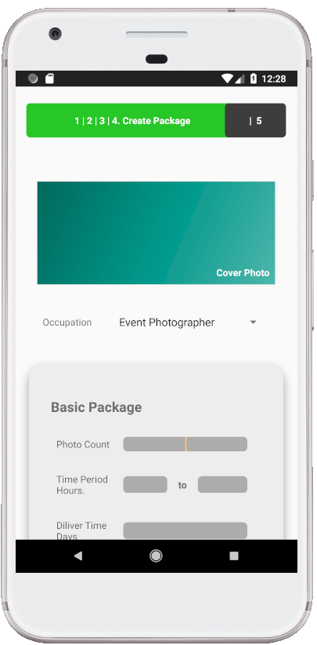

# CaptureIT Android Application
CaptureIt Project

This application is buid to enhance the communication between Photographers and customers.CaptureIT mobile application will make a virtual platform where customers can book
photographers easily and quickly, on the other hand photographers/studios can improve their
business and skills in a convenient way. In addition, the two parties can communicate through
messages and photographers/studios can upload photos. Furthermore, by the map (GPS
system) customers can book the nearest best photographer to have their photoshoots done.

# Downloads

Download the Captureit App Apk by clicking this link

https://github.com/Pasan99/CaptureITProject/raw/master/downloads/app-debug.apk

# Screenshots

# Services Used
Database - Firebase (by GOOGLE) 
Android Studio 
Language - Java 

# Reffered Websites
Google material Design - https://material.io/ 
Android Developers Website - https://developer.android.com/ 
Firebase - https://firebase.google.com/ 
Design - https://dribbble.com/ 
Icons - https://www.flaticon.com/ 

# Reffered Youtube channels
Android Developer - https://www.youtube.com/user/androiddevelopers 
Firebase - https://www.youtube.com/user/Firebase 
Google Design - https://www.youtube.com/channel/UClKO7be7O9cUGL94PHnAeOA 
Google Developer - https://www.youtube.com/channel/UC_x5XG1OV2P6uZZ5FSM9Ttw 

# Knowledge Areas Covered
<h2>Android Development</h2>
<h3>Views (Works with functions related to these views)</h3>
<ul>
  <li>Buttons</li>
  <li>RecycleView</li>
  <li>ImageView</li>
  <li>Text View</li>
  <li>EditTextView/ Email/ Password and etc</li>
  <li>CircleImageView</li>
  <li>Switch</li>
  <li>Checkbox</li>
  <li>FloatingAction Button</li>
  <li>CalendarView</li>
  <li>ProgressBar</li>
  <li>Spinner</li>
  <li>Navigation View</li>
  <li>GoogleMaps</li>
</ul>
<h3>ViewGroups/layout (Works with functions related to these layouts)</h3>
<ul>
  <li>Constraint layout</li>
  <li>Nested Scroll view</li>
  <li>Fragments</li>
  <li>Scroll View</li>
</ul>

<h3>Services</h3>
<ul>
  <li>Google Maps API</li>
  <li>Firebase Real time database</li>
  <li>Android Services (Vibrator/ Read and Write storage/ Internet Access/ Phone/ Location/ GPS)</li>
</ul>

<h3>Android Animations</h3>
<h3>Android Gestures</h3>
<h3>JAVA PROGRAMMING</h3>

See All java classes that I have created in this project. It will give you rough idea about my programming knowledge and Java language knowlwdge.

<a href="https://github.com/Pasan99/CaptureITProject/tree/master/app/src/main/java/com/example/pasan/captureitproject">See All</a>

  
